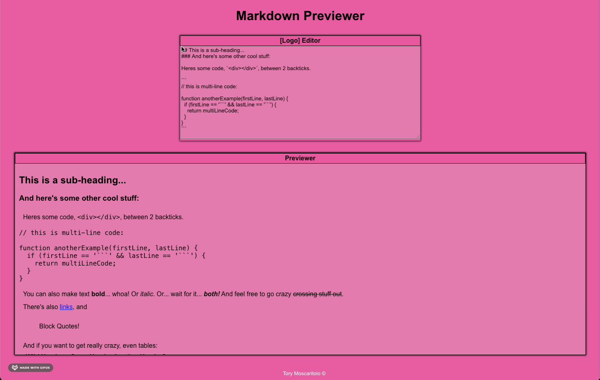

# Markdown Previewer

This is a project I did as part of FreeCodeCamp's Front End Library Course. 

### Aim

The primary aim was to use React or any other front end libraries I have learnt to create a Markdown Previewer tool, that will immediately display anything entered into the editor box as Markdown Text in the preview box below it.

#### Languages Used

I primarily used React.js, Redux and CSS.

I also used Marked.js Library to parse the text.
[Marked.js](https://marked.js.org/)

#### Preview

### Note:
* It's quite basic at the moment, just a way to test what I've learnt, but I plan to update in future.